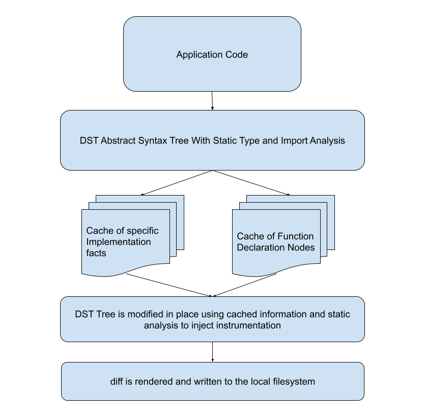

# Parser
Parser is a static analysis library that can detect and inject instrumentation code into a Go application. 



It does this in the following steps.

1. Generate an abstract syntax tree from the application using DST. A unique tree will be generated for every package in the parsed application. Trees
get stored in a cache that seperates data based on the pacakage it belongs to, and can be looked up by the path of that package, which is a unique identifier.

2. Walk the syntax tree for each package in a given application. While we do that, we build a new data structure that contains data mapped by package. This data structure is looking for a few key pieces of information, but primarily, it is looking for user defined function declarations. These declarations are objects in the tree, and we can uniquely identify them by package name, and function name. Additional key information is discovered with `FactDiscoveryFunctions` and cached in an object called the `FactStore`, which can be used for recognizing key information that is not available in the scope of a single package or function call.

3. Once we have gathered all our facts and impelentation data, we have all the information we need to instrument an application. The tool will walk through the entire syntax tree for each package again, making this the second full walk of the tree(s). This time, it will look for sections of code where middleware can be injected, tracing has already been started by middleware, or tracing could potentially be started using `StatelessTracingFunctions`. Then it will apply tracing to that section of code, as well as all reachable code that is called from the current scope, using `StatefulTracingFunctions`. Once this has completed, a modified tree with complete instrumentation written into the code has been built.

4. Restore the modified tree back to code. That code is compared to the original application, and a GIT compatible diff is generated in memory. This diff file is written to a file in the local operating system where the user can review it and decide how to proceed.

## Components

### Manager
The manager maintains the state of this application, and is a centralized place where you can get resources and information that can help you develop instrumentation tools. It also exports a number of methods that can be invoked to execute parts of the instrumentation workflow. This is where contextual information we generate about "implementation facts", and declared functions get cached. Its also where we store the go packages information. The manager will always do two walks of the abstract syntax tree of an application. During the first walk, it caches information about all the function declarations in the application for later use.

### Fact Discovery Functions
FactDiscoveryFunction identify a "Fact" about a code pattern, which can be referenced later to identify patterns that are essential for instrumentation. This function is executed on all nodes in the syntax tree of every function declared in an application. Facts are deterministic labels assigned to specific patterns. When a FactDiscoveryFunction identifies a fact in a node of the abstract syntax tree (AST), it should return a FactEntry for the manager to cache for future use.

Here is an example of a `FactDiscoveryFunction` that finds a server stream object in gRPC code. Knowing the type of this allows us to detect it later and fetch
instrumentation from it.

```go
// FindGrpcServerObject scans for a call to Register...Server in the package
// It uses this call to identify the gRPC server Implementation object
func FindGrpcServerObject(pkg *decorator.Package, node dst.Node) (facts.Entry, bool) {
	if node == nil {
		return facts.Entry{}, false
	}

	expr, ok := node.(*dst.ExprStmt)
	if !ok {
		return facts.Entry{}, false
	}

	// look for gRPC server registration call
	call, ok := expr.X.(*dst.CallExpr)
	if !ok || !isGrpcRegisterServerCall(call, pkg) {
		return facts.Entry{}, false
	}

	// get the server object that was registered
	serverHandlerIdent, ok := getRegisteredServerIdent(call)
	if !ok {
		return facts.Entry{}, false
	}

	// find the type of the server object
	handlerType := util.TypeOf(serverHandlerIdent, pkg)
	if handlerType == nil {
		return facts.Entry{}, false
	}

	// this is an interface, so the object will always be a pointer in the implemented code
	handlerTypeString := handlerType.String()
	if handlerTypeString[0] != '*' {
		handlerTypeString = "*" + handlerTypeString
	}
	return facts.Entry{Name: handlerTypeString, Fact: facts.GrpcServerType}, true
}
```

### Stateful Tracing Functions
`StatefulTracingFunctions` are functions that require knowledge of the state of New Relic tracing in the current scope of the application in order to apply their changes. That state is stored in the `tracestate.State` object. `StatefulTracingFunctions` are executed against every line of code in the body of a function being traced, as well as every line of code in functions that are declard in this application and called by the function being traced.

Here is an example of how we add interceptors to gRPC servers. These interceptors need to be passed the go agent, so it requires knowledge of the 
current state of tracing.

```go
// InstrumentGrpcServer adds the New Relic gRPC server interceptors to the grpc.NewServer call
func InstrumentGrpcServer(manager *InstrumentationManager, stmt dst.Stmt, c *dstutil.Cursor, tracing *tracestate.State) bool {
	// determine if this is a gRPC server initialization
	callExpr, ok := grpcNewServerCall(stmt)
	if !ok {
		return false
	}

	// inject middleware
	callExpr.Args = append(callExpr.Args, codegen.NrGrpcUnaryServerInterceptor(tracing.AgentVariable(), callExpr))
	callExpr.Args = append(callExpr.Args, codegen.NrGrpcStreamServerInterceptor(tracing.AgentVariable(), callExpr))
	manager.addImport(codegen.NrgrpcImportPath)
	return true
}
```

### Stateless Tracing Functions
`StatelessTracingFunctions` are a powerful tool for identifying and modifying specific sections of code. These functions operate independently, without needing information about the current scope of the code they analyze, the Go agent application, Go agent transactions, or any prior modifications to the code. They are particularly effective in detecting code segments suitable for middleware injection or initiating tracing when middleware is already present.

These functions are ideal for scenarios where a consistent operation can be applied to a specific code pattern. Stateless Tracing Functions are loaded into the manager during initialization and are executed during the second traversal of the abstract syntax tree (AST) on every node in the tree.

Here is an example of a `StatelessTracingFunction` that detects functions that are methods of a gRPC server, then instruments and traces them. This function works because we have gathered facts that we can use to recognize the type that implements the gRPC server, and because we know that our stateful function will inject middleware into all gRPC servers that creates transactions for us. The lowercase functions are helper functions, and the `InstrumentGrpcServerMethod` is the `StatelesTracingFunction`.

```go
// getTxnFromGrpcServer finds the transaction object from a gRPC server method
// This is done by looking for a context object or a stream server object in the function parameters
// and then pulling the transaction from that object and assigning it to a variable.
func getTxnFromGrpcServer(manager *InstrumentationManager, params []*dst.Field, txnVariableName string) (*dst.AssignStmt, bool) {
	// Find stream server object parameters first
	var streamServerIdent *dst.Ident
	var contextIdent *dst.Ident

	pkg := manager.getDecoratorPackage()
	f := manager.facts

	for _, param := range params {
		if len(param.Names) == 1 {
			paramType := util.TypeOf(param.Names[0], pkg)
			if paramType != nil {
				// check if this is a stream server object or a context object
				paramTypeName := paramType.String()
				fact := f.GetFact(paramTypeName)
				if fact == facts.GrpcServerStream {
					streamServerIdent = param.Names[0]
				} else if paramTypeName == contextType {
					contextIdent = param.Names[0]
				}
			}
		}
	}

	if streamServerIdent != nil {
		return codegen.TxnFromContext(txnVariableName, codegen.GrpcStreamContext(streamServerIdent)), true
	} else if contextIdent != nil {
		return codegen.TxnFromContext(txnVariableName, contextIdent), true
	}

	return nil, false
}

// isGrpcServerMethod checks if a function declaration is a method of the user's gRPC server
// based on facts generated from scanning their gRPC configuration code.
func isGrpcServerMethod(manager *InstrumentationManager, funcDecl *dst.FuncDecl) bool {
	if funcDecl.Recv == nil || len(funcDecl.Recv.List) != 1 || len(funcDecl.Recv.List[0].Names) != 1 {
		return false
	}

	// attempt to get the type of the receiver
	pkg := manager.getDecoratorPackage()
	recvType := util.TypeOf(funcDecl.Recv.List[0].Names[0], pkg)
	if recvType == nil {
		return false
	}

	// check if the receiver is a gRPC server method using the FactStore
	recvTypeString := recvType.String()
	fact := manager.facts.GetFact(recvTypeString)
	return fact == facts.GrpcServerType
}

// InstrumentGrpcServerMethod finds methods of a declared gRPC server and pulls tracing through it
func InstrumentGrpcServerMethod(manager *InstrumentationManager, c *dstutil.Cursor) {
	n := c.Node()
	funcDecl, ok := n.(*dst.FuncDecl)
	if ok && isGrpcServerMethod(manager, funcDecl) {
		// find either a context or a server stream object
		txnAssignment, ok := getTxnFromGrpcServer(manager, funcDecl.Type.Params.List, codegen.DefaultTransactionVariable)
		if ok {
			// ok is true if the body of this function has any tracing code added to it. If this is true, we know it needs a transaction to get
			// pulled from the grpc server object
			node, ok := TraceFunction(manager, funcDecl, tracestate.FunctionBody(codegen.DefaultTransactionVariable))
			decl := node.(*dst.FuncDecl)
			if ok {
				decl.Body.List = append([]dst.Stmt{txnAssignment}, decl.Body.List...)
			}
		}
	}
}
```


## Best Practices
There are a few best practices that should always be followed when contributing code to this library.

1. Due to the complex nature of what we are testing, unit tests will always be missing something. For this reason, it is best to keep the scope of the unit tests
small, and focus on enforcing a set of expected behaviors on a function. This will help us protect against regressions as we add more features and modify the code in the future.
2. Always cover new instrumentation with [end to end tests](../end-to-end-tests/README.md). These are the most robust way to catch edge cases, and are a non-negotiable requirement for every feature added.
3. All code generation functionality should be written as an exported function in internal/codegen. This allows us to re-use that code across the application mroe easily.
4. Use `internal/util.TypeOf` to type check things rather than using DST node paths when possible. This is more reliable, and accurate.